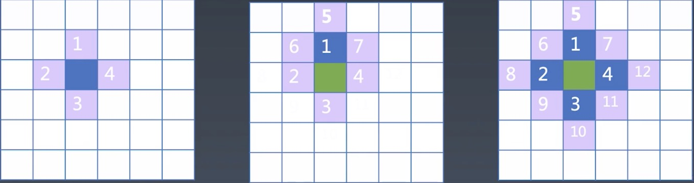

学习笔记

# W2 - 寻路算法 地图编辑器

## 什么是寻路

所谓寻路算法，就是地图上寻找到一个点到另一个点之间的可到达路径。

本质上，一张地图就是由多个像素点构成的，同一单位下的像素点越多，越密集，则清晰度越高。

在寻路上，采用广度优先算法会优于深度优先算法。

## 实现思路

在广度优先算法的基础上，我们还可以采用 A* 寻路算法，进一步优化我们的寻路功能。

## 开始实现

要实现整体功能，我们要先进行步骤拆解，一步一步的实现。首先第一步我们要实现一个基本的地图。

### 创建一个地图

这里，我们创建一个 100 * 100 的地图，也就是 10000 个像素点。

递归是一个深入优先搜索算法，而寻路问题是一个广度优先搜索优先的问题。

基本的 HTML 结构和样式：
````html
<div id='container'></div>

<style>
 .cell {
    display: inline-block;
    line-height: 7px;
    width: 6px;
    height: 6px;
    background-color: #999;
    border-bottom: solid 1px white;
    border-right: solid 1px white;
    vertical-align: middle;
    user-select: none; /* 防止在某些浏览器下出现可拖拽的情况 */
  }
  #container {
    width: 701px;
    line-height: 0;
  }
</style>
````

HTML 部分比较容易理解，这里就不过多解释。对于 10000 个像素点，我们通过 JS 的方式去创建：

````javascript
const container = document.getElementById('container');
const map = Array(100 * 100).fill(0)

const render = () => {
  for (let x = 0; x < 100; x++) {
    for (y = 0; y < 100; y++) {
      const cell = document.createElement("div");
      cell.classList.add("cell");
      container.append(cell);
    }
  }
};
render();
````

这里，我们定义了一个 render 函数，执行该函数，可以在页面中绘制一个 100 * 100 像素点的地图。

### 鼠标绘制功能

鼠标绘制功能可以帮助我们在屏幕中绘制一些路径，我们将鼠标绘制的路径称为“墙”。

对于有“墙”的地方，在路径寻址的时候，“墙”会被视作无法走到的点。

````javascript
// 添加 mousedown 标记，配合 cell mouseover 事件
let mousedown = false;
container.addEventListener('mousedown', () => mousedown = true);
container.addEventListener('mouseup', () => mousedown = false);

const render = () => {
  for (let y = 0; y < 100; y++) {
    for (x = 0; x < 100; x++) {
      const cell = document.createElement("div");
      cell.classList.add("cell");

      // 添加鼠标绘制功能
      cell.addEventListener('mousemove', () => {
        if (mousedown) {
          cell.style.backgroundColor = 'black';
        }
      });
      container.append(cell);
    }
  }
}
````

### 可达像素点的查找/能否到达



要想知道起点能走到哪，就是要把起点周围能走的点找到，然后，在进一步往外扩张。

如上图中的第一个地图，我们把蓝色的点看作起点，发现可走的点有 1、2、3、4 点。

紧接着，我们在看看看从 1 可以走到 5、6、7 三个点。

后面的同理，我们一次把 2、3、4 可以走到的点加进来，得到8、9、10、11、12。

**总的来看，寻路的解决办法，就是不断的把可走的点展开，加入集合中。**

> 递归并不适合来处理该问题。因为递归是深度优先，比如找到 1，会继续找 1 可走的点。对于寻路问题来说，深度优先搜索是不好的，广度优先搜索是好的。

我们的存储的点，需要遵循先进显出的原则（队列），所以我们需要结合 push + shift。

> JavaScript Array 是一个天然的队列和栈。如果 push 和 shift 相对，那么就是一个队列（如果 pop 和 unshift 也是队列），如果 push 和 pop 作为一组来使用，那么就是栈（shift 和 unshift 一样，但是不会用该方法，考虑到 js 的数组实现，该方法性能会比较低）。

````javascript
function findPaht (map, start, end) {
  const queue = [start];
  const table = Object.create(map);
  
  const insert = (x, y, pre) => {
    if ( x < 0 || x >= 100 || y < 0 || y >= 100) {
      // 因为我们的地图是 100 * 100 的，
      // 所以x、y 坐标点不可能超过 0  - 100
      return;
    }
    if (table[y * 100 + x]) { // 如果该像素点已存在数组，也不做处理
      return
    }
    // 为该像素点赋值，并填充颜色
    table[y * 100 + x] = pre;
    container.children[y * 100 + x].style.backgroundColor = 'lightgreen';
    // 将该点写入 queue 中，等待后续使用
    queue.push([x, y])
  }

  // 循环处理 queue，遵循先进先出原则
  while (queue.lenght) {
    let [x, y] = queue.shift();
    if (x === end[0] && y === end[1]) { // 已经到达终点
      return true;
    }
    // 没有到达的话，则将该点四周的点记录到 queue 中
    // 这里其实就对应前面的图示
    insert(x - 1, y, [x, y]);
    insert(x + 1, y, [x, y]);
    insert(x, y -1, [x, y]);
    insert(x, y + 1, [x, y]);
  }
}
````

### 可达路径的查找

每个点我们都知道上一个点是什么，所以寻找最终路径。我们只需要将当前的像素点标记为前驱节点即可。

通过 while 循环沿着 pre 的链路去生成一个路径。

````javascript
// ...
if (x === end[0] && y === end[1]) {
  let path = [];
  while (x !== start[0] || y !== start[1]) {
    path.push(map[y * 100 + x])
    [x, y] = table[y * 100 + x];
    container.children[y * 100 + x].style.backgroundColor = 'purple';
  }
  return true;
}
// ...
````

### 启发式搜索（A 寻路）

> A* 寻路是 A 寻路的一个特例。

其实前面的路径查找是有问题的，通过动画可以看到，广度优先的搜索方式导致

广搜寻路并不是最好的寻路方式。我们可以有一种方法加速寻路的方案，不需要挨个的一个个寻找。

我们可以对每次扩展的点做一个优先级，优先的去找优先级较高的点。只要启发式的搜索的估值小于一定的值，那么一定是能找到最优路径的启发式搜索。

所以，我们需要对 `queue` 数据结构做修改，修改成一个能够做优先级排序的方法。

保证每次 take 的时候拿到一个最小的（也就是 shift），这样就达到了一个排序的效果。

> 对于 take 的删除操作，splice 是一个 O(N) 的操作，因为 splice 把被删除元素删除后，会把后续的元素都往前挪，所以性能不太好。我们希望每次的写操作都是 O(1) 的操作。所以我们可以采取将最后一个元素覆盖当前要删除的元素，然后使用 pop 在将最后一个元素删除，便可达到 O(1) 的效果。

````javascript
class Sorted {
  constructor (data, compare) {
    this.data = data.slice();
    this.compare = compare || ((a, b) => a - b);
  }
  // 实现 shift 效果的基础上，添加排序效果，保证每次拿到的值最小
  take () {
    if (!this.data.length) {
      return;
    }
    let min = this.data[0];
    this.minIndex = 0;

    for (let i = 1; i < this.data.length; i++) {
      if (this.compare(this.data[i], min) < 0) {
        min = this.data[i];
        minIndex = i;
      }
    }

    this.data[minIndex] = this.data[this.data.length - 1];
    this.data.pop();
    return min;
  }

  give (v) {
    this.data.push(v);
  }
}
````

**distance**

````javascript
function distance (point) {
  // 两点之间的距离，
  return (point[0] - end[0]) ** 2 + (point[0] - point[1]) ** 2;
}

// ...
const queue = new Sorted([start], (a, b) => distance(a) - distance[b]);
````

### 路径查找动画

为了方便看到路径的查找过程，我们可以采取动画的过程，将每一个像素点的填充绘制都展示出来。

利用 async/await 可以做到。

````javascript
function sleep (t) {
  return new Promise(resolve => {
    setTimeout(resolve, t)
  })
}
````

然后我们在像素点绘制的地方调用该方法：

````javascript
// ...
sleep(30);
cell.style.backgroundColor = 'lightgreen';
// ...

// ...
while (x !== start[0] || y !== start[1]) {
  path.push(map[y * 100 + x])
  [x, y] = table[y * 100 + x];
  sleep(30);
  container.children[y * 100 + x].style.backgroundColor = 'purple';
}
// ...
````

> `async/await` 会有「传染性」，所有调用 `async/await` 地方，都需要添加对应的 `async` 或 `await` 关键字。所以，在实际情况中，需要注意这一点。

## 其他的一些知识细节

### 推荐使用分号

在 JS 中，分号并不是必须的，所以不写分号也是一些代码规范推荐的风格（如 Standard）。

但是，这样在一些场景下会有问题的，比如：

````javascript
let [x, y] = [0, 0]
const arr = [5, 5]
// 为 x、y 赋值
[x, y] = arr
````

上面代码其实是有问题的，如果运行的话会报如下错误：
````
VM4468:4 Uncaught ReferenceError: Cannot access 'arr' before initialization
````

其原因就是分号导致的。

### 一维数组表示二维数组

### splice 

splice 是 O(N) 操作。

### localStorage


## 参考 DEMO

这里我把完整代码写在了 codesandbox ，大家可以对照实际的运行 DEMO 去探究。

[DEMO](https://codesandbox.io/s/xunlusuanfa-ditubianjiqi-h5pvd?file=/index.html)
winner tree
heap 堆